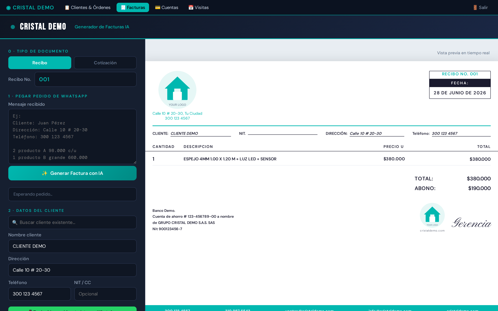
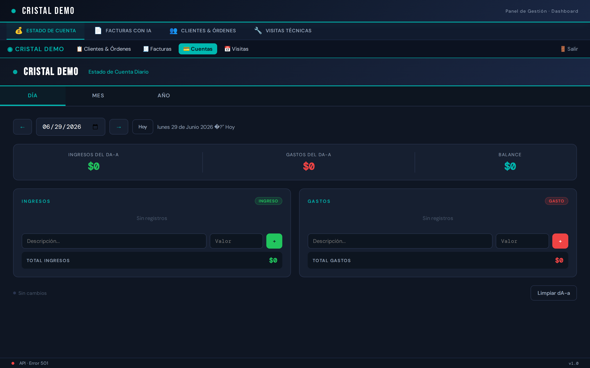
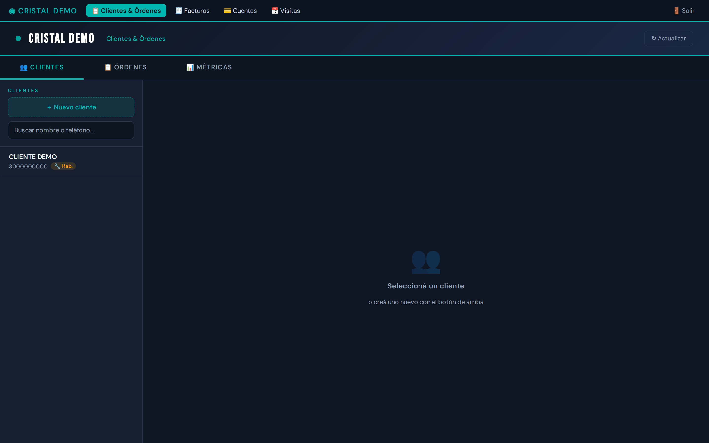
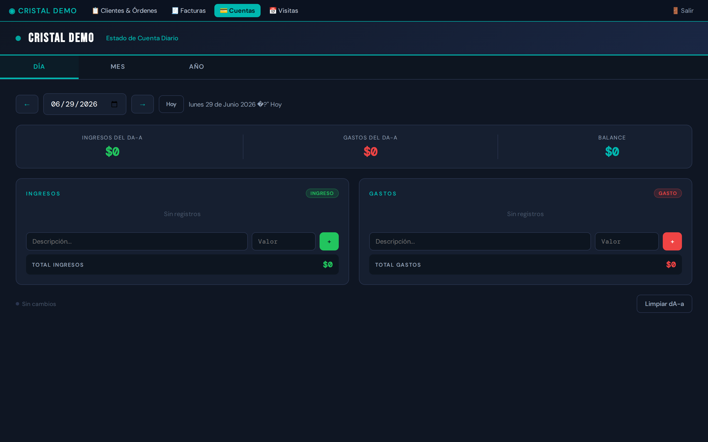
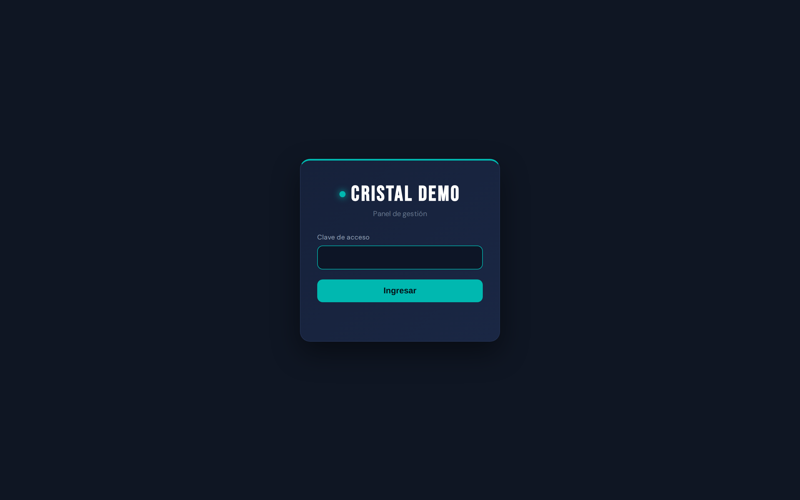

<p align="center">
  
</p>

<h1 align="center">Waizen</h1>

<p align="center"><i>AI agents that run your business operations.</i></p>

> **The AI operating layer for small & medium businesses.**
> Waizen is an AI agent that *runs* day-to-day business operations — quoting, invoicing,
> customer management, order tracking, scheduling, accounting and WhatsApp customer service —
> through a unified web panel it can read and act on.

> 🚧 **Work in progress.** Waizen is in active development toward commercialization.
> This public repository is a **showcase** of the architecture and capabilities.
> The production-tuned agent, managed hosting and integrations are part of the commercial offering
> (see [License](#license)).

---

## The idea

Most small businesses run on WhatsApp, a paper notebook and a calculator. Waizen replaces that
with an **AI agent that operates the business end-to-end**: it talks to customers, builds quotes,
turns them into receipts when the deal closes, moves orders through the pipeline
(quote → fabrication → install → ready → delivered), keeps the books, and schedules visits —
while the owner just supervises from a single panel.

The agent doesn't just *chat*. It **acts** on a real operational stack (the dashboards + API in this
repo), so its actions are persisted, auditable and reflected in real documents (PDF receipts, etc.).

## Proven in production 🧪

This stack powered a **real glass & aluminum business** as a pilot — handling real customers on
WhatsApp 24/7, generating quotes and receipts, tracking orders through fabrication and delivery,
and keeping daily accounts — for weeks, on a single cloud VM. Waizen is the productization of that
proven system for any small business.

## Modules

| Module | What it does |
|---|---|
| 📋 **Clients & Orders** | Client database + order pipeline (quote/fabrication/install/ready/delivered), metrics, receivables, inline PDF preview, on-the-fly receipt regeneration. |
| 🧾 **Quote / Invoice generator** | Builds quotes & receipts; **AI extraction** turns a pasted WhatsApp message into line items; client autocomplete; clean **landscape PDF**. |
| 💳 **Accounts** | Daily income & expense tracking per business day. |
| 📅 **Technical visits** | Schedule and log on-site visits / installs. |
| 🤖 **WhatsApp agent** | Conversational customer service, welcome cards, automated follow-ups (via OpenClaw + LLM). |
| 🔒 **Auth & panel** | Token-based login, single launcher, nav between tools. |
| 🖨️ **PDF engine** | Client-side (jsPDF + html2canvas) and **server-side headless-Chrome** generation for batch / regeneration. |

## 📸 Screenshots

> Rendered with sample data on a demo business (*"Cristal Demo"*).

**Quote / invoice generator** — paste a WhatsApp order → AI extracts the line items → clean landscape PDF:



| Unified panel | Clients & Orders |
|:--:|:--:|
|  |  |
| **Daily accounts** | **Login** |
|  |  |

## Architecture

```
                 WhatsApp ── customers
                     │
              ┌──────▼───────┐        ┌─────────────────────────────┐
              │  AI Agent    │        │        Web Panel            │
              │ (OpenClaw +  │  reads │  Clients · Orders · Quotes  │
              │   LLM)       │◄──────►│  Accounts · Visits · Login  │
              └──────┬───────┘  acts  └──────────────┬──────────────┘
                     │                                │ /api
              ┌──────▼────────────────────────────────▼──────┐
              │                  API (Python)                 │
              │  auth · data (JSON) · find/serve PDFs ·        │
              │  save-pdf · regen-pdf · follow-ups · ai-proxy  │
              └──────┬───────────────────────────┬────────────┘
                     │                            │
              ┌──────▼──────┐            ┌────────▼────────┐
              │  PDF gen     │            │  Reverse proxy  │
              │ (Playwright) │            │  (Caddy + auth) │
              └─────────────┘            └─────────────────┘
```

## Tech stack

- **Frontend:** dependency-free HTML/JS dashboards (one file per tool).
- **Backend:** Python (standard-library HTTP server), signed-cookie token auth.
- **PDF:** `jsPDF` + `html2canvas` (browser) and `Playwright`/Chromium (server, batch & regen).
- **AI agent:** [OpenClaw](https://openclaw.ai) — WhatsApp channel + LLM, isolated per-business workspace.
- **LLM:** Google Gemini (`gemini-2.5-flash` with `flash-lite` fallback).
- **Infra:** Caddy (reverse proxy, automatic HTTPS, auth gate), Docker, `systemd` user services (24/7).

## Quick start

> This is a showcase build. Real secrets and business data are **not** included — only `.example` files and empty samples.

```bash
cp config.example.json config.json     # business name, logo, contact, bank, colors
cp .env.example .env                    # API keys, auth hash (see comments inside)
python3 setup.py                        # applies your config to the templates
```

Full guide in [`docs/SETUP.md`](docs/SETUP.md).

## Repository layout

```
waizen/
├── dashboard/   # web panel (clients, quotes, accounts, visits, login, launcher)
├── api/         # Python backend (data API, auth, PDF endpoints, follow-ups)
├── pdfgen/      # server-side PDF generator (Playwright/Chromium)
├── agent/       # WhatsApp AI agent: personality, context, skills
├── infra/       # Caddy, docker-compose, systemd units
├── data/samples # empty/sample data files
└── docs/        # setup & architecture docs
```

## Status

🚧 **In active development.** Not a turnkey product yet — this repo documents the system and
showcases the work behind Waizen. Stars & feedback welcome.

## License

This repository is published for **portfolio / demonstration purposes**. See [`LICENSE`](LICENSE).
Waizen is a commercial product in development; no license is granted for commercial use or deployment.
For commercial / licensing inquiries, see the contact in `config.example.json`.
